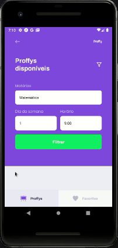

# Proffy

To run this app it is necessary to install and run [this api](https://github.com/NearMaick/NLW-Proffy-server).

## Available Scripts

To run this app mobile it is necessary to instal expo cli:

### `yarn global add expo-cli`  

It's necessary to run: 

### `yarn`

To install all packages and dependecies;

In the project directory, you can run:

### `yarn start`

Runs the app in the development mode. 
Open your device on debuging mode or android emulator via [expo client](https://play.google.com/store/apps/details?id=host.exp.exponent&referrer=www)

The app will reload if you make edits. 